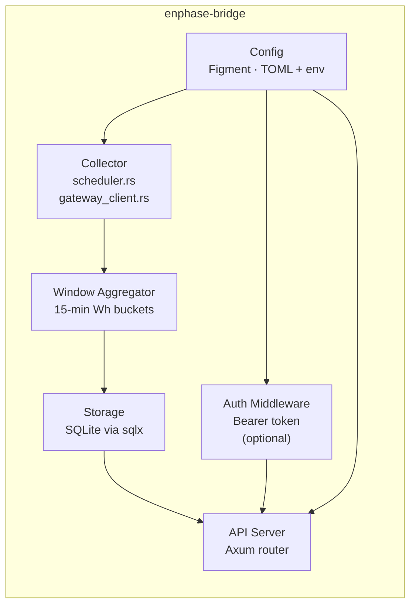

# Architecture

## System overview

```mermaid
graph TD
    GW["Enphase IQ Gateway\n(LAN: 192.168.x.x)"]
    DB[(SQLite)]
    SVC["enphase-bridge\n(Rust daemon)"]
    PROXY["Reverse Proxy\n(Caddy / nginx — optional)"]
    CLIENT["Client\n(scripts · dashboards · apps)"]
    OPENEI["OpenEI URDB\n(TOU rate schedule)"]

    GW -- "HTTPS + JWT\n(every N seconds)" --> SVC
    OPENEI -- "Rate schedule\n(on demand)" --> SVC
    SVC -- "read / write" --> DB
    SVC -- "REST API\n(:8080)" --> PROXY
    PROXY -- "HTTPS" --> CLIENT
    CLIENT -- "direct HTTP\n(LAN only)" -.-> SVC
```

The daemon runs on your LAN alongside the Enphase IQ Gateway. It polls the gateway over HTTPS using a local JWT, aggregates the data into 15-minute windows, persists everything to SQLite, and exposes it via a REST API. A reverse proxy (Caddy, nginx) is optional but recommended for HTTPS termination if you expose the API outside your own device.

## Internal layout



| Component | File(s) | Responsibility |
|-----------|---------|----------------|
| Collector | `src/collector/scheduler.rs`, `gateway_client.rs` | Timed polling of the IQ Gateway over HTTPS |
| Window Aggregator | `src/collector/window_aggregator.rs` | Buckets raw readings into 15-minute Wh windows |
| Storage | `src/storage/` (sqlx + SQLite) | Persists windows, inverter snapshots, TOU rates |
| API Server | `src/api/server.rs`, `src/api/handlers/` | Axum HTTP router serving all REST routes |
| Auth Middleware | `src/auth/` | Optional Bearer token gate; validates on each request |
| Config | `src/config.rs` (Figment) | Merges TOML file + environment variable overrides |

## Technology choices

| Choice | Rationale |
|--------|-----------|
| **Rust** | Memory safety + predictable performance for a long-running home daemon; low resource footprint on Raspberry Pi / NAS |
| **Axum** | Ergonomic async HTTP framework built on Tokio; plays well with sqlx |
| **sqlx + SQLite** | Single-file database; zero server process; survives power loss with WAL mode |
| **Figment** | Layered configuration (TOML → env vars) with no boilerplate |
| **Docker / GHCR** | Multi-platform image (`linux/amd64`, `linux/arm64`) published to GitHub Container Registry |
