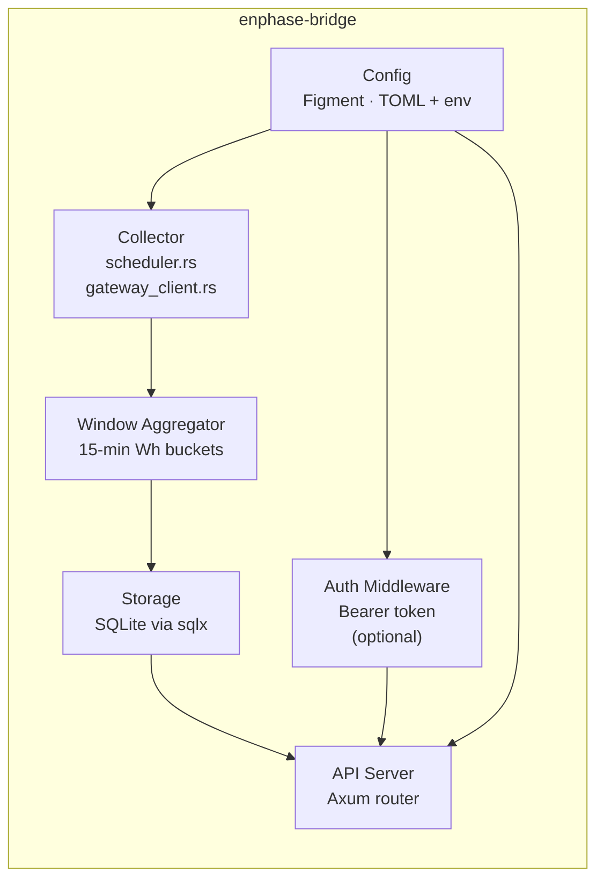

# Architecture

**[→ Open interactive architecture diagram](./architecture.html)**
(color-coded component map with data flow, isolation table, and startup recompute flow)

---

## System overview

```mermaid
graph TD
    GW["Enphase IQ Gateway\n(LAN: 192.168.x.x)"]
    DB[(SQLite)]
    SVC["enphase-bridge\n(Rust daemon)"]
    PROXY["Reverse Proxy\n(Caddy / nginx — optional)"]
    CLIENT["Client\n(scripts · dashboards · apps)"]
    OPENEI["OpenEI URDB\n(TOU rate schedule)"]

    GW -- "HTTPS + JWT\n(every N seconds)" --> SVC
    OPENEI -- "Rate schedule\n(on demand)" --> SVC
    SVC -- "read / write" --> DB
    SVC -- "REST API\n(:8080)" --> PROXY
    PROXY -- "HTTPS" --> CLIENT
    CLIENT -- "direct HTTP\n(LAN only)" -.-> SVC
```

The daemon runs on your LAN alongside the Enphase IQ Gateway. It polls the gateway over HTTPS using a local JWT, aggregates the data into 15-minute windows, persists everything to SQLite, and exposes it via a REST API. A reverse proxy (Caddy, nginx) is optional but recommended for HTTPS termination if you expose the API outside your own device.

## Internal layout



| Component | File(s) | Responsibility |
|-----------|---------|----------------|
| GatewayClient | `src/collector/gateway_client.rs` | HTTPS transport + session cookie management; returns `MeterReadings` with typed cumulatives, raw JSON, and channel data |
| `extract_cumulatives_from_json` | `src/collector/gateway_client.rs` | Pure fn — JSON parsing and EID selection, no HTTP; shared by live path and `recompute_windows --mode raw` |
| WindowAggregator | `src/collector/window_aggregator.rs` | Pure math: `window_boundary()`, `compute_delta()`, `CURRENT_FORMULA_VERSION` constant |
| Scheduler | `src/collector/scheduler.rs` | Orchestration hub — poll loop, boundary detection, 4-branch transaction decision tree, power-sample accumulator (ephemeral, max 15 tuples) |
| StartupRecompute | fn in `src/collector/scheduler.rs` | One-shot auto-heal before poll loop: re-runs `compute_delta` on stale rows from `boundary_snapshot` pairs |
| Storage | `src/storage/` (sqlx + SQLite) | Per-table query modules: `energy_window`, `boundary_snapshot`, `power_sample`, `phase_reading`, `microinverter_snapshot`, `config_store`, `tou_rate_schedule` |
| API Server | `src/api/server.rs`, `src/api/handlers/` | Axum HTTP router — read-only; no gateway access; no writes |
| TOU refresh loop | `src/tou/refresh.rs` | Background loop: re-fetches OpenEI rate schedule if stale (&gt;7 days), then sleeps 7 days |
| recompute_windows | `src/bin/recompute_windows.rs` | CLI tool: `--mode typed` (re-runs compute_delta from boundary_snapshot) or `--mode raw` (re-parses raw JSON for EID/extraction bugs); `--dry-run` supported |
| Auth Middleware | `src/api/middleware/api_key.rs` | Optional Bearer token gate; implemented but not yet wired into config |
| Config | `src/config.rs` (Figment) | Merges TOML file + `ENPHASE__` environment variable overrides |

## Technology choices

| Choice | Rationale |
|--------|-----------|
| **Rust** | Memory safety + predictable performance for a long-running home daemon; low resource footprint on Raspberry Pi / NAS |
| **Axum** | Ergonomic async HTTP framework built on Tokio; plays well with sqlx |
| **sqlx + SQLite** | Single-file database; zero server process; survives power loss with WAL mode |
| **Figment** | Layered configuration (TOML → env vars) with no boilerplate |
| **Docker / GHCR** | Multi-platform image (`linux/amd64`, `linux/arm64`) published to GitHub Container Registry |
